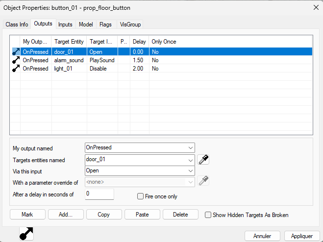
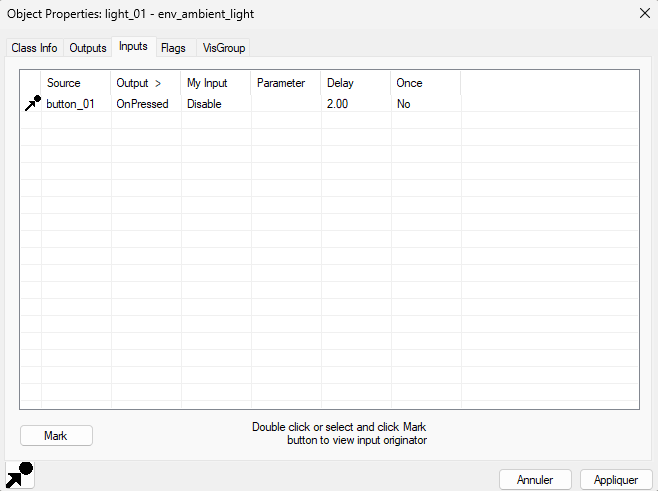

# WireKit

> A Source-inspired Inputs / Outputs system for Unreal Engine. Let your game designers wire up levels straight from the Details panel. No Blueprint graphs, no code.


> ⚠️ **Early development.** WireKit is a personal project and is being built in the open. The API will change, features are missing, and it is not production-ready yet. Check the [roadmap](#roadmap) to see where things stand.

---

## Table of contents

- [The problem](#the-problem)
- [The inspiration: Source Engine I/O](#the-inspiration-source-engine-io)
- [The vision for WireKit](#the-vision-for-wirekit)
- [How it will work](#how-it-will-work)
- [Roadmap](#roadmap)
- [Installation](#installation)
- [Contributing](#contributing)
- [Credits](#credits)
- [License](#license)

---

## The problem

In Unreal Engine, making two actors in a level talk to each other almost always means Blueprint. Either the Level Blueprint grows into an unreadable wall of nodes, or actors end up holding hard references to each other through custom variables and casts.

For a programmer, that's fine. For a game designer who just wants *"when the player presses this button, open that door two seconds later"*, it's a lot of friction:

- They have to open a graph and understand execution flow, casts and references.
- The logic is hidden away from the level itself. Selecting the button in the viewport doesn't tell you what it does.
- Iterating on a sequence (change a delay, retarget a door, add a sound) means going back into a graph every time.

## The inspiration: Source Engine I/O

Valve's Source Engine solved this problem years ago with its **Inputs and Outputs** system, used to script every map of games like *Half-Life 2*, *Portal* and *Left 4 Dead*.

The idea is simple:

- **Outputs** are events an entity fires when something happens to it : `OnPressed`, `OnTrigger`, `OnDeath`, `OnTimer`…
- **Inputs** are actions an entity can perform when told to : `Open`, `Close`, `Enable`, `Kill`, `PlaySound`…
- A **connection** links an output of one entity to an input of another, with an optional parameter, a delay, and a limit on how many times it can fire.

Level designers set all of this up in Hammer's **Object Properties** dialog, as a simple list:



*The Outputs tab in Hammer. Each line connects an event of this entity to an action on another one.*

Hammer also shows the reverse view, listing every entity that targets the selected one, which makes debugging a map much easier:



*The Inputs tab. Who is talking to this entity?*

On top of that, Source ships a set of **logic entities** (`logic_relay`, `logic_timer`, `math_counter`, `logic_compare`, `logic_auto`…) that turn this simple wiring into a real visual scripting language. With nothing but I/O and a few logic entities, a level designer can build a keypad door, a timed puzzle or a full combat arena sequence.

For a deeper look at the original system, see the [Inputs and Outputs page on the Valve Developer Community](https://developer.valvesoftware.com/wiki/Inputs_and_Outputs).

## The vision for WireKit

WireKit brings this workflow to Unreal Engine, while feeling native to it. The goals are:

1. **Zero code for designers.** Everything a designer needs lives in the Details panel of the actors they place. Pick an output, pick a target, pick an input, done.
2. **Zero friction for programmers and technical designers.** Any Blueprint Custom Event automatically becomes an input. No interface to implement, no base class to inherit from.
3. **Readable levels.** Select an actor and immediately see what it triggers and what triggers it, both in the Details panel and as wires in the viewport.
4. **A real toolbox.** A set of ready-made logic actors (relay, timer, counter, compare, branch, trigger volume…) so designers can build complex sequences on their own.
5. **Great debugging.** A console command to fire any input by hand, a log of every event, and an on-screen overlay showing wires as they fire.
6. **Modern Unreal support.** Work with level streaming and World Partition from the start.

## How it will work

### For game designers

1. Add a **Wire Component** to any actor and give it a name, like `button_01`.
2. In the **Outputs** section, add a connection : `OnPressed` → `door_01` → `Open`, with an optional delay and parameter.
3. Hit Play.

## Roadmap

### Phase 1: Runtime core
- [ ] `UWireComponent` with a serialized list of connections
- [ ] `UWireSubsystem` with actor registration and name lookup
- [ ] Firing outputs and calling inputs by name (C++ and Blueprint)
- [ ] Typed parameters parsed from text
- [ ] Wildcard targets (`door_*`)
- [ ] Special targets : `!self`, `!activator`, `!caller`
- [ ] Delayed events and "times to fire" limit
- [ ] `CancelPending` input to cancel queued events
- [ ] Built-in inputs on every actor : `Enable`, `Disable`, `Kill`

### Phase 2: Editor tools
- [ ] Details panel customization with filtered dropdowns for outputs and inputs
- [ ] Actor picker (eyedropper) for targets
- [ ] Validation with clear errors (missing target, unknown input, bad parameter)
- [ ] Reverse "Inputs" view. Which actors target the selected one
- [ ] Viewport visualizer drawing wires between connected actors
- [ ] Full Undo / Redo support

### Phase 3: Logic actors
- [ ] `WireAuto`: fires on level start
- [ ] `WireRelay`: groups several outputs behind a single input
- [ ] `WireTimer`: fires at fixed or random intervals
- [ ] `WireCounter`: counts up / down, fires at min or max
- [ ] `WireCompare`: compares a value and fires accordingly
- [ ] `WireBranch`: boolean branching
- [ ] `WireCase`: switch on a value
- [ ] `WireTrigger`: volume with `OnStartTouch` / `OnEndTouch` and filters

### Phase 4: Debugging
- [ ] `wirekit.fire <target> <input> [parameter]` console command
- [ ] Event log (every fired output and called input)
- [ ] On-screen overlay drawing wires as they fire
- [ ] Dump of the pending event queue

### Phase 5: Production readiness
- [ ] Level streaming and World Partition support
- [ ] Multiplayer. Server authoritative execution
- [ ] Performance pass
- [ ] Demo level fully scripted with WireKit
- [ ] Complete documentation and tutorials

## Installation

> Not usable yet. These instructions will apply once the first version is out.

1. Clone this repository into your project's `Plugins/` folder:
   ```
   git clone https://github.com/IjulienI/WireKit.git
   ```
2. Regenerate project files and build.
3. Enable **WireKit** in *Edit → Plugins*.

**Compatibility:** Unreal Engine 5.4+.

## Contributing

Feedback is very welcome! Since the project is still young, the most useful thing right now is to open an **issue** to report a bug, suggest a feature, or share your experience with Source's I/O or similar systems in other engines.

## Credits

WireKit is being developed as a personal project in game tools programming. The full development history is available in this repository.

Heavily inspired by the Inputs and Outputs system of Valve's Hammer editor and Source Engine. WireKit is an independent project and is not affiliated with or endorsed by Valve Corporation. Screenshots of Hammer are used for illustration purposes only.

## License

Distributed under the MIT License. See [`LICENSE`](LICENSE) for details.